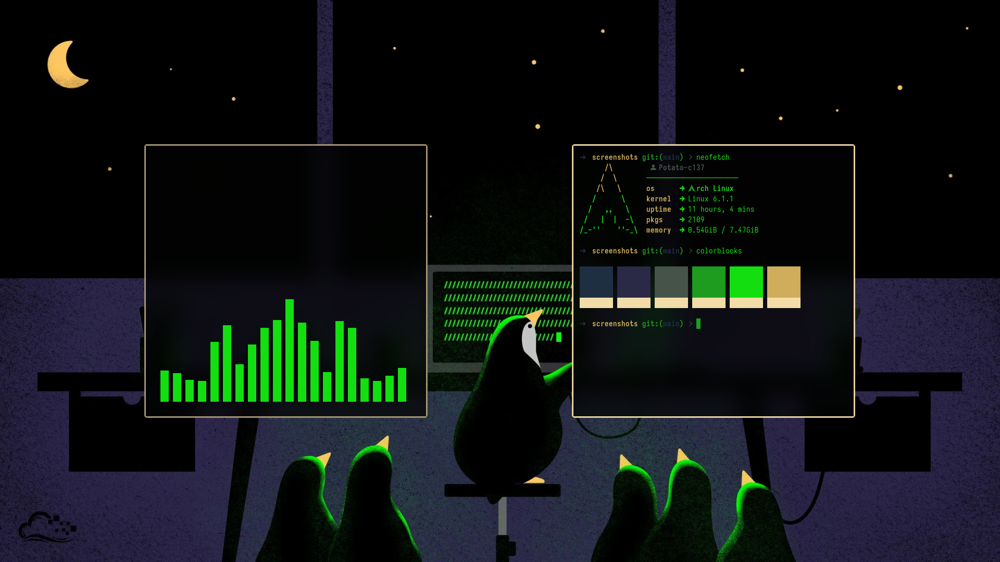

## Dwm config

this is an installer ( tested and working with only archlinux )

---

## Screenshots

---

| system        | apps                 |
| ------------- | -------------------- |
| **terminal**  | st                   |
| **launcher**  | rofi                 |
| **bar**       | dwmbar( the og bar ) |
| **wallpaper** | feh                  |

> NB:: if you dont use sddm please try to autostart script in /Scipts/dwmC in your login manager

### More Info

Dwm build

the dwm build is from my [dwm repo](https://github.com/potato-c137/dwm)

## 

st build

the st build in from my [st repo](https:///github.com/potato-c137/st)

---

The bar

i use the dwmbar ( the one dwm came with )

it is in `dwmConfig/Scripts/usr/` , make sure to move everything in Scripts/usr folder to `/usr/bin/` execpt the installers

the autostart script calls it so it needs to be in path

---

Autostart script

the autostart script is in `/Scripts/dwmC/autostartdwm.sh`

**i use sddm so i call it in ~/.xprofile**

it starts : picom, dunstrc, dwmbar , polykit(xfce4) , feh , and a term instance to call tty-clock

move the folder ./Scripts/dwmC/ to ~/dwm

In the xprofile it will call ~/dwm/autostartdwm.sh and the dunstrc config file too

---

Rofi

the rofi runners are in ./Scripts/usr/rofi_menu_run and rofi_network_run

the rofi_menu_run one calls menu and the rofi_network_run calls the network one,

the call other config files in ./Scripts/dwmC/rofi/ which was to be placed in ~/dwm/

---

**wallpaper was set with feh**

